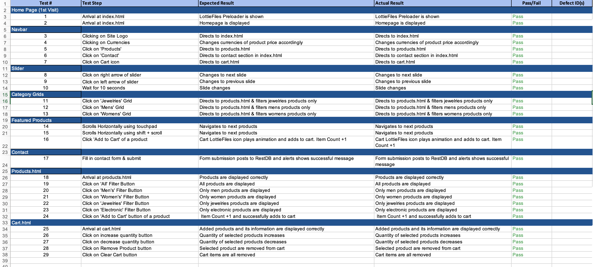
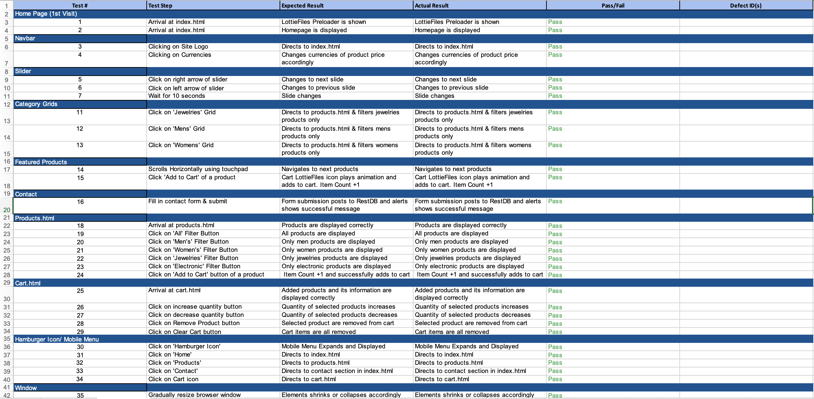

# ID_Team1_PK4.0_Assg3
This website is created for the third assignment of the Interactive Development module, a year-1 module in the pursuance of our diploma studies at Ngee Ann Polytechnic.

It is jointly developed and designed by Jordan Choi & Poh Jia Yong.

Tutorial Group: T01 
Lecturer: Mr Andy Ng 
Team Number: 1 
Team Name: PK 4.0 

This is our attempt to create an interactive eCommerce website, utilizing LottieFiles for animations, RestDB for storing the contact messages via the contact form and FakeStore API for generation of the mock products.

The goal of this website is to mimic real-life shopping experience and creates an enjoyable, interactive experience to the users.

## Design Process & Rationale
There are no specific users for this website, and anyone can use it. This website utilizes FakeStore API for the list of products. The website is designed with a traditional layout imbued with animations, and modern design styles.

### Website’s Scope & Agenda:
1. Mimics Real Life Shopping Experience
2. Interactive & Fun to Use.
3. Simple & Intuitive
4. Easy to Use
5. Great UX
### Color Scheme:
* Navbar: #F8F9FA
* Font: #000000
* Body: #FFFFFF, #B3E1FF
* Footer: #212629

Live Demo:
> [https://jordanchoi.github.io/ID_Team1PK4.0_Website/](https://jordanchoi.github.io/ID_Team1PK4.0_Website/)

## Features
### Existing Features in the Website
1. Responsive Design 
    > Site supports across most devices and screen sizes.
2. Collapsible Hamburger Icon for Tablet & Mobile
    > Navigation bar will be hidden and hamburger icon will be expanded when website is visited from a tablet or mobile device.
3. Preloader
    > Preloader was added using LottieFiles to welcome users in a way, and a way to load all of the necessary codes prior to presentation to the users.
4. Local Storage
    > Local Storage was used to store the added cart items.
5. Currency
    > Users are able switch currency from the buttons pre-defined on the header, depending on the user's country of origin.
6. Horizontal Browsing
    > As mobile device browsers are getting more popular, we implemented an horizontal browsing of items for the users in the homepage.
7. Contact Form
    > Contact Form are implemented for users to contact with the store. Every form submissions are submitted to RestDB for collection and stored in the database.
8. Adding Items to Cart
    > Selected items are added into the cart by pressing the "Add to Cart" button.
9. Category Filter
    > Users can filter the products' categories in the Product page by clicking on one of the pre-defined category buttons.
### Potential Features
1. Wheel of Fortune Game
   > A lucky draw game for users to win prizes, by spinning the wheel when spent a certain amount.
2. Drag & Drop to Cart
   > Allow users to select and drag products directly into the cart icon with the mouse.
3. Individual Products Page
   > Clicking on a product generates its own modal box and display the product's details.
4. Payment
   > Paypal API was considered to be implemented to facilitate the checkout process. However, since no actual transaction will be done, this feature was not implemented.
## Technologies Used
* HTML5
  * HTML5 was used in this project for the structure, contents and layout.
* CSS3
  * CSS3 was used in this project for the styles and appearance of the website.
* [Bootstrap 5.0](https://getbootstrap.com/)
  * Bootstrap 5.0 was used for fast and responsive website.
* JavaScript
  * Vanilla JavaScript was used in this project to increase the interactiveness of the website and for multiple aspects of the site.
* [jQuery](https://jquery.com/)
  * jQuery was used to manipulate DOMs of the website.
* API
  * APIs was used for various aspects of the site such as the contact form, products and currency conversions.
* JSON
  * JSON was used to create and retrieve Local Storage - to store items added to cart..
* Adobe Photoshop
  * Adobe Photoshop was used to create and resize the graphical medias used in the site.
### Scripts Used
* [Lottie Player](https://unpkg.com/@lottiefiles/lottie-player@latest/dist/lottie-player.js)
  * Lottie-Player.js is embedded and utilized for the animations used in the site such as the cart icon and the preloaders.

### API Used
* [RestDB](https://restdb.io/)
  * RestDB API is used for the storage and database of the contact form submissions. No GET requests are made as the platform to display the form submissions are not implemented. However, every form submissions are POST to the RestDB database.

* [Exchange Rate API](https://exchangeratesapi.io/)
  * ExchangeRate API is used for the conversion of the original products price retrieved through the FakeStore API.

* [FakeStore API](https://fakestoreapi.com/)
  * FakeStore API is used and utilized for the generation of the products.  The products are used as a mock products for our eCommerce website.

## Testing
  ### Desktop
  

  ### Mobile
  
## Credits
* Framework
  * [Bootstrap 5.0](https://getbootstrap.com/)
* Libraries & Scripts
  * [jQuery](https://jquery.com/)
* Fonts
  * **Google Fonts** - Karla, Montserrat, Playfair Display, Work Sans, Open Sans
* Media
  * Preloader
    * MATI UR REHMAN, ECOMMERCE STORE, LottieFiles - Retrieved from https://lottiefiles.com/34612-ecommerce-store
  * Cart & Products Loader
    * Adrien Bourmault, Spinner Loading, LottieFiles - Retrieved from https://lottiefiles.com/528-spinner-loading
  * Cart Icon
    * Dannie Wulff Madsen, Cart Checkout - Fast, LottieFiles, Retrieved from https://lottiefiles.com/4914-cart-checkout-fast
  * Image in About Section
    * jcomb, Online Shopping Banner Mobile App Template, Freepik, Retrieved from https://www.freepik.com/free-vector/online-shopping-banner-mobile-app-templates-concept-flat-design_11878916.htm#page=1&query='Shopping&position=41
  * Original Jewelries Category Grid in Homepage
    * Freepik, Freepik, Retrieved from https://www.freepik.com/free-vector/yellow-gray-paper-style-background_11906897.htm#page=2&query=yellow+abstract&position=4
  * Original Men Category Grid in Homepage
    * starline, Freepik, Retrieved from https://www.freepik.com/free-vector/modern-wavy-shapes-abstract-curvy-stylish-background_8866250.htm#page=2&query=blue+abstract&position=44
  * Icons in Contact Section
    * Freepik, Freepik, Retrieved from https://www.flaticon.com/packs/apple-logos-2
  * Country Flags
    * Wikimedia, Singapore Flag, Retrieved from https://upload.wikimedia.org/wikipedia/commons/thumb/4/48/Flag_of_Singapore.svg/1200px-Flag_of_Singapore.svg.png
    * Renewable Energy, USA Flag, Retrieved from https://renewableenergyupdates.in/wp-content/uploads/2020/09/USA-1.jpg
    * Country Flags, Japan Flag, Retrieved from https://www.countryflags.com/wp-content/uploads/japan-flag-png-xl.png
    * Country Flags, Korea Flag, Retrieved from https://www.countryflags.com/wp-content/uploads/south-korea-flag-png-xl.png
    * Flagpedia, China Flag, Retrieved from https://flagpedia.net/data/flags/w580/cn.png
  * Empty Cart Image
    * Vector Juice, Freepik, Retrieved from https://www.freepik.com/free-vector/removing-goods-from-basket-refusing-purchase-changing-decision-item-deletion-emptying-trash-online-shopping-app-laptop-user-cartoon-character_11669671.htm#page=1&query=Empty%20Cart&position=8
  * Original Creation
    * Logo - TeamPK
    * Banner No. 1
  * Images of Products belongs to:
    * FakeStore API.
  
## References & Acknowledgments
* Bootstrap Documentation
  * [Bootstrap Documentation](https://getbootstrap.com/docs/5.0/getting-started/introduction/)
* Product Cards in Homepage
  * [Horizontal Scroll Carousel, Tripp W.](https://codepen.io/zepzia/pen/JMZovd)
* W3Schools Filter Element
  * [Filter Elements](https://www.w3schools.com/howto/howto_js_filter_elements.asphttps://www.w3schools.com/howto/howto_js_filter_elements.asp)